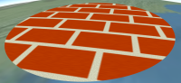
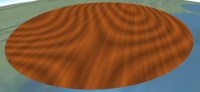
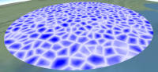

**Cesium Material Pack**: A plugin with procedurally-shaded materials such as bricks, wood, and noise patterns.

**Cesium version**: Tested against [b24](http://cesiumjs.org/downloads.html).  Most likely works with older and newer versions.  Post a message to the [Cesium forum](http://cesiumjs.org/forum.html) if you have compatibility issues.

**License**: Apache 2.0.  Free for commercial and non-commercial use.  See [LICENSE.md](LICENSE.md).

TODO: install
TODO: usage

Contributions welcome.  We use the [same CLA as Cesium](https://github.com/AnalyticalGraphicsInc/cesium/blob/master/CONTRIBUTING.md).  Please email yours before opening a pull request.
