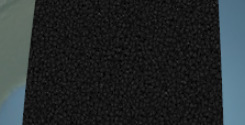
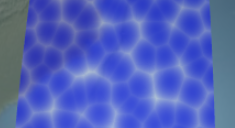
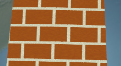
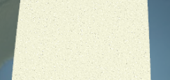
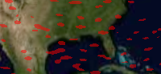
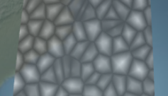
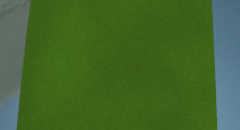
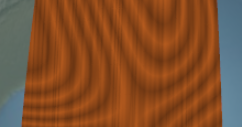

<p align="center">
<a href="http://cesium.agi.com/">

</a>
</p>

**Cesium Material Pack**: A plugin with procedurally-shaded materials such as bricks, wood, and noise patterns.

Check out the [demo](http://analyticalgraphicsinc.github.io/cesium-materials-pack/Example/).

| Name | Screenshot | Description |
|:-----|:-----------|:------------|
| `Asphalt` |  | Asphalt generated with a combination of simplex and cellular noise. |
| `Blob` |  | Blob generated with cellular noise.  Resembles water, but clumped in a cell pattern. |
| `Brick` |  | Brick generated with a combination of a simple brick pattern and simplex noise for roughness. |
| `Cement` |  | Cement generated with simplex noise. |
| `Erosion` |  | Animated erosion. |
| `Facet` |  | Facet generated with cellular noise. |
| `Grass` |  | Grass generated with simplex noise. |
| `TieDye` |  | Tie-dye generated with simplex noise. |
| `Wood` |  | Wood generated with simplex noise. |

**Cesium version**: Tested against [b24](http://cesiumjs.org/downloads.html).  Most likely works with older and newer versions.  Post a message to the [Cesium forum](http://cesiumjs.org/forum.html) if you have compatibility issues.

**License**: Apache 2.0.  Free for commercial and non-commercial use.  See [LICENSE.md](LICENSE.md).

**Usage**

To use the plugin, load the built script and call `initializeMaterialPack` with the the global `Cesium` object as the argument.

```
<script type="text/javascript" src="path/to/Cesium.js" />
<script type="text/javascript" src="path/to/CesiumMaterials.js" />
<script type="text/javascript">
// ...
CesiumMaterials.initializeMaterialPack(Cesium);
// ...
var primitives = scene.getPrimitives();
primitives.add(new Cesium.ExtentPrimitive({
    extent : new Cesium.Extent(
                Cesium.Math.toRadians(-120.0),
                Cesium.Math.toRadians(20.0),
                Cesium.Math.toRadians(-60.0),
                Cesium.Math.toRadians(40.0)),
    material : Cesium.Material.fromType('Brick')
}));
</script>
```

For how to use Cesium materials, see the [Fabric tutorial](https://github.com/AnalyticalGraphicsInc/cesium/wiki/Fabric).

Material uniforms:
<ul>
    <li>Asphalt</li>
    <ul>
        <li><code>asphaltColor</code>:  rgba color object for the asphalt's color.</li>
        <li><code>bumpSize</code>:  Number for the size of the asphalt's bumps.</li>
        <li><code>roughness</code>:  Number that controls how rough the asphalt looks.</li>
    </ul>
    <li>Blob</li>
    <ul>
        <li><code>lightColor</code>:  rgba color object for the light color.</li>
        <li><code>darkColor</code>:  rgba color object for the dark color.</li>
        <li><code>frequency</code>:  Number that controls the frequency of the pattern.</li>
    </ul>
	<li>Brick</li>
	<ul>
		<li><code>brickColor</code>:  rgba color object for the brick color.</li>
		<li><code>mortarColor</code>:  rgba color object for the mortar color.</li>
		<li><code>brickSize</code>:  Number between 0.0 and 1.0 where 0.0 is many small bricks and 1.0 is one large brick.</li>
		<li><code>brickPct</code>:  Number for the ratio of brick to mortar where 0.0 is all mortar and 1.0 is all brick.</li>
		<li><code>brickRoughness</code>:  Number between 0.0 and 1.0 representing how rough the brick looks.</li>
		<li><code>mortarRoughness</code>:  Number between 0.0 and 1.0 representing how rough the mortar looks.</li>
	</ul>
    <li>Cement</li>
    <ul>
        <li><code>cementColor</code>:  rgba color object for the cement's color. </li>
        <li><code>grainScale</code>:  Number for the size of rock grains in the cement. </li>
        <li><code>roughness</code>:  Number that controls how rough the cement looks.</li>
    </ul>
    <li>Erosion</li>
    <ul>
        <li><code>color</code>:  diffuse color and alpha.</li>
        <li><code>time</code>:  Time of erosion.  1.0 is no erosion; 0.0 is fully eroded.</li>
    </ul>
    <li>Facet</li>
    <ul>
        <li><code>lightColor</code>:  rgba color object for the light color.</li>
        <li><code>darkColor</code>:  rgba color object for the dark color.</li>
        <li><code>frequency</code>:  Number that controls the frequency of the pattern.</li>
    </ul>
    <li>Grass</li>
    <ul>
        <li><code>grassColor</code>:  rgba color object for the grass' color. </li>
        <li><code>dirtColor</code>:  rgba color object for the dirt's color. </li>
        <li><code>patchiness</code>:  Number that controls the size of the color patches in the grass.</li>
    </ul>
    <li>TieDye</li>
    <ul>
        <li><code>lightColor</code>:  rgba color object for the light color.</li>
        <li><code>darkColor</code>:  rgba color object for the dark color.</li>
        <li><code>frequency</code>:  Number that controls the frequency of the pattern.</li>
    </ul>
    <li>Wood</li>
    <ul>
        <li><code>lightWoodColor</code>:  rgba color object for the wood's base color.</li>
        <li><code>darkWoodColor</code>:  rgba color object for the color of rings in the wood.</li>
        <li><code>ringFrequency</code>:  Number for the frequency of rings in the wood.</li>
        <li><code>noiseScale</code>:  Object with x and y values specifying the noisiness of the ring patterns in both directions.</li>
    </ul>
</ul>

**Build**

The following targets can be built:
   * `build` - A fast, developer-oriented build that prepares the source tree for use as standard [Asynchronous Module Definition (AMD)](https://github.com/amdjs/amdjs-api/wiki/AMD) modules.
   * `combine` - Runs `build`, plus uses [NodeJS](http://nodejs.org/) to run [the RequireJS optimizer](http://requirejs.org/docs/optimization.html) to combine Cesium materials and [the Almond AMD loader](http://requirejs.org/docs/faq-optimization.html#wrap) to produce an all-in-one file in the `Build/CesiumMaterials` directory.
   * `minify` - Runs `combine`, plus [minifies](http://en.wikipedia.org/wiki/Minification_(programming\)) CesiumMaterials.js using [UglifyJS2](https://github.com/mishoo/UglifyJS2) for a smaller deployable file.
   * `clean` - Removes all generated build artifacts.

Specify the target(s) at the command line:

<pre>
./Tools/apache-ant-1.8.2/bin/ant [target-name] [another-target-name] ...
</pre>

To run the example locally, run a server from the root directory and browse to <code>localhost:port/Example</code>.

Contributions welcome.  We use the [same CLA as Cesium](https://github.com/AnalyticalGraphicsInc/cesium/blob/master/CONTRIBUTING.md).  Please email yours before opening a pull request.
